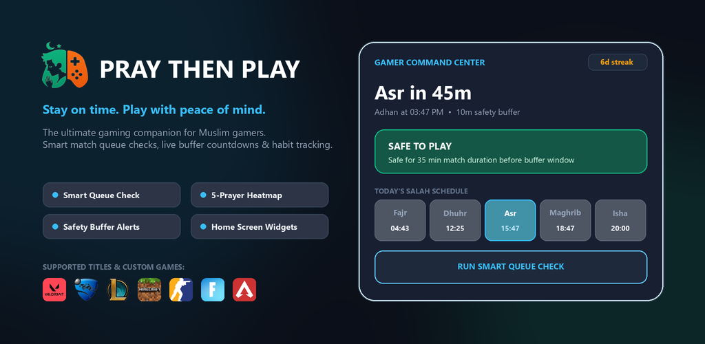

# 🎮 Pray Then Play (PTP) — The Gaming Salah Companion

<div align="center">



### *Salah first. Gaming second. Stay on time. Play with peace of mind.*

[](https://flutter.dev)
[](https://dart.dev)
[](https://android.com)
[](https://microsoft.com)
[](#-100-private-offline-first-architecture)
[](#-global-internationalization-i18n--10-languages)
[](LICENSE)

[Features](#-key-features) • [Architecture](#-architecture--tech-stack) • [Installation](#-getting-started) • [Widgets](#-native-android-home-screen-widgets) • [Themes](#-11-theme-matrix--lighting-engine) • [Localization](#-global-internationalization-i18n--10-languages) • [Ecosystem](#-the-pray-then-play-ecosystem)

</div>

---

## 🌟 Executive Summary

**Pray Then Play** (*PTP*) is the premier gaming companion and spiritual habit tracker engineered specifically for Muslim gamers. It eliminates the friction between competitive gaming and Islamic prayer commitments (*Salah*).

By cross-referencing high-precision astronomical prayer calculations against match durations, queue times, overtime variances, and custom safety buffers, **Pray Then Play** provides real-time, deterministic queue verdicts. Muslim gamers never have to abandon teammates, receive AFK penalties, or rush/delay their prayers again.

---

## 📑 Table of Contents

- [🌟 Executive Summary](#-executive-summary)
- [🎯 The Problem & Our Solution](#-the-problem--our-solution)
- [✨ Key Features](#-key-features)
  - [🛡️ Smart Queue Check & Decision Engine](#️-smart-queue-check--decision-engine)
  - [🕌 High-Precision Global Prayer Calculation](#-high-precision-global-prayer-calculation)
  - [⏱️ Live In-Match HUD & Session Planner](#️-live-in-match-hud--session-planner)
  - [📊 5-Prayer Consistency Heatmap & Spiritual Tracking](#-5-prayer-consistency-heatmap--spiritual-tracking)
  - [🎮 Preconfigured AAA Game Library & Custom Creator](#-preconfigured-aaa-game-library--custom-creator)
  - [🎨 11-Theme Matrix & Dynamic Lighting Engine](#-11-theme-matrix--dynamic-lighting-engine)
  - [🌍 Global Internationalization (i18n) — 10 Languages](#-global-internationalization-i18n--10-languages)
  - [📱 Native Android Home Screen Widgets](#-native-android-home-screen-widgets)
  - [💻 Desktop Experience & System Integration](#-desktop-experience--system-integration)
  - [🔒 100% Private, Offline-First Architecture](#-100-private-offline-first-architecture)
- [🏗️ Architecture & Tech Stack](#️-architecture--tech-stack)
- [📁 Project Directory Structure](#-project-directory-structure)
- [🚀 Getting Started](#-getting-started)
  - [Prerequisites](#prerequisites)
  - [Installation & Local Run](#installation--local-run)
  - [Building Production Binaries](#building-production-binaries)
- [🌐 The Pray Then Play Ecosystem](#-the-pray-then-play-ecosystem)
- [🤝 Contributing](#-contributing)
- [📜 License](#-license)

---

## 🎯 The Problem & Our Solution

| The Gamer's Dilemma | The Pray Then Play Solution |
|---|---|
| **Ranked Match Risk**: Queuing a 40-minute Valorant or CS2 match with only 30 minutes before Adhan leads to mid-game AFKs, lost Elo, and delayed prayers. | **Deterministic Math**: Calculates uninterrupted gaming windows minus customizable safety buffers (5m, 10m, 15m), accounting for maximum match times and overtime. |
| **Guilt & Anxiety**: Checking the clock constantly mid-game degrades gaming focus and prayer mindfulness (*Khushu*). | **Instant Verdicts**: Clear color-coded queue status (🟢 Safe, 🟡 Caution, 🔴 Risky) and live countdown HUD. |
| **Inconsistent Habits**: Difficulty maintaining 5 daily prayers on time over busy gaming weeks. | **Discipline Heatmap**: Visual 12-week GitHub-style matrix, streak counters, and habit metrics that celebrate spiritual consistency. |
| **Intrusive Apps**: Prayer apps with ads, subscription paywalls, and location tracking violate privacy. | **Zero Ads, Zero Tracking**: 100% offline, free, open-source, and private on-device calculation. |

---

## ✨ Key Features

### 🛡️ Smart Queue Check & Decision Engine

The core brain of Pray Then Play calculates your uninterrupted gaming window before the next prayer window closes:

$$\text{Available Window} = \text{Time Until Adhan} - \text{Safety Buffer}$$

```
                [ CURRENT TIME ] ─────────────────────────► [ ADHAN ]
                       │                                       │
                       ├──────── Available Window ─────────────┤
                       │                                       │
                [ CURRENT TIME ] ───► [ MATCH ] ───► [ BUFFER ] ───► [ ADHAN ]
                                       ▲ Safe to Queue! ▲
```

- **Dynamic Status Verdicts**:
  - 🟢 **Safe to Play**: Ample time to finish your full match without rushing.
  - 🟡 **Play With Caution / Quick Modes Only**: Switch to Swiftplay, ARAM, Casual, or Spike Rush.
  - 🔴 **Imminent Adhan / Stop & Pray**: Prayer is imminent or due. Stop queuing, perform Wudu, and pray first.
- **Overtime & Variance Analysis**: Considers competitive overtime risks (e.g., infinite OT in Valorant, MR12 OT in CS2, Golden Goal in Rocket League).
- **Three Protection Levels**:
  - **Relaxed (5 min buffer)**: Maximizes playtime for experienced players.
  - **Balanced (10 min buffer - Recommended)**: Standard comfortable margin for Wudu and preparation.
  - **Strict (15 min buffer)**: Extra time for Jama'ah (Mosque attendance) and post-prayer Sunnah.

---

### 🕌 High-Precision Global Prayer Calculation

- **Astronomical Precision**: Powered by the industry-standard `adhan` astronomical engine using on-device GPS coordinates or selected cities.
- **Global Preconfigured Cities**: 40+ curated major cities across MENA, Europe, North America, Central Asia, South Asia, and Southeast Asia.
- **Supported Calculation Methods**:
  - Muslim World League (MWL)
  - Umm Al-Qura University, Makkah
  - Egyptian General Authority of Survey
  - University of Islamic Sciences, Karachi
  - Islamic Society of North America (ISNA)
  - Diyanet İşleri Başkanlığı (Turkey)
  - Gulf Region / UAE Authority
  - Kuwait, Qatar, Singapore, and Shia Ithna-Ashari (Jafari)
- **Asr Juristic Methods**:
  - Standard / Majority (Shafi'i, Maliki, Hanbali, Ja'fari) — 1:1 shadow ratio
  - Hanafi — 2:1 shadow ratio
- **Flexible Time Formats**: Instant toggle between 12-Hour (AM/PM) and 24-Hour Military format across all displays and widgets.
- **Specialized Modes**:
  - **Jumu'ah Mode**: Automatically expands Friday Dhuhr buffers to accommodate Friday sermon (*Khutbah*) and congregational prayer.
  - **Fajr Protection Mode**: High-priority alert threshold to protect dawn prayer habits.

---

### ⏱️ Live In-Match HUD & Session Planner

- **Live In-Match HUD**: An active overlay timer tracking match progression, elapsed game time, remaining prayer countdown, and color-coded safety badges.
- **Post-Match Logger**: Seamlessly records match conclusion, logs whether prayer was maintained on time, and updates gaming discipline scores.
- **Interactive Session Planner**: Plan multi-hour sessions (1 to 6+ hours). The planner automatically maps your entire timeline, visualizing game periods, scheduled Salah breaks, and 15-minute resumption checkpoints.

---

### 📊 5-Prayer Consistency Heatmap & Spiritual Tracking

- **12-Week (84-Day) Consistency Matrix**: A GitHub-style daily heatmap covering all 5 prayers: **Fajr, Dhuhr, Asr, Maghrib, and Isha**.
- **Multi-State Prayer Logging**:
  - 🟢 **On-Time**: Prayed within the optimal window.
  - 🌟 **Jama'ah / Mosque**: Performed in congregation.
  - 🟡 **Late**: Completed before the next prayer, but delayed.
  - 🔴 **Missed**: Missed or unperformed.
  - ⚪ **Upcoming / Not Recorded**: Future prayers or clean unrecorded slate.
- **Spiritual Diary & Reflection Notes**: Attach personal reflections, Quran Ayah notes, or daily gaming reflections to each prayer entry.
- **Gaming Discipline Metrics**:
  - *Protected Prayers*: Total Salahs saved from overlapping with gaming.
  - *Avoided Risky Queues*: Count of times you chose not to queue when safety was red.
  - *Stopped to Pray*: Count of intentional gaming pauses for Salah.
  - *Short Game Choices*: Intelligent mode switches to shorter formats.
- **Achievement & Badge Unlocks**: Earn rewards like *First Step*, *Queue Discipline*, *Consistent Week*, and *Prayer Protector*.

---

### 🎮 Preconfigured AAA Game Library & Custom Creator

Pray Then Play comes loaded with tailored activity profiles for the world's most popular competitive and casual titles:

| Game Title | Category | Configured Modes & Typical Durations |
|---|---|---|
| **Valorant** | Competitive | Ranked (40m), Unrated (35m), Swiftplay (15m), Deathmatch (10m), Spike Rush (8m) |
| **League of Legends** | Competitive | Ranked Solo/Duo (35m), Normal Draft (30m), ARAM (20m), Arena (15m) |
| **Counter-Strike 2** | Competitive | Premier / Comp (40m), Wingman 2v2 (15m), Casual / DM (10m) |
| **Rocket League** | Competitive | Ranked 2v2/3v3 (7m), Scheduled Tournament (35m), Casual (6m) |
| **Fortnite** | Competitive | Ranked Battle Royale (22m), Casual BR / Zero Build (18m), Creative / Lego (20m) |
| **Apex Legends** | Competitive | Ranked Battle Royale (20m), Mixtape / Gun Run (12m) |
| **Overwatch 2** | Competitive | Competitive Role Queue (20m), Quick Play / Arcade (10m) |
| **Dota 2** | Competitive | Ranked All Pick (45m), Turbo Mode (25m) |
| **Rainbow Six Siege** | Competitive | Ranked / Standard (30m), Quick Match (12m) |
| **EA Sports FC 25** | Competitive | UT Champions / Rivals (18m), Career Mode (15m) |
| **CoD: Warzone** | Competitive | Battle Royale Squads (25m), Resurgence / Plunder (15m) |
| **Minecraft** | Casual / Sandbox | Survival (45m), Hardcore (60m), Bedwars / PvP (15m), Creative (30m), SMP (45m) |
| **GTA V / FiveM** | Casual / RP | FiveM Roleplay (60m), Online Heists (35m), Story Mode (30m) |
| **Terraria** | Casual / Co-Op | Adventure (30m), Boss Fight Progression (15m) |
| **Stardew Valley** | Casual / Co-Op | 1-Day In-Game Cycle (15m), Co-Op Farm Session (40m) |
| **Roblox** | Casual / Multi | Casual Obby / Chill (20m), Competitive Rivals (12m) |
| **Brawl Stars** | Mobile / Comp | Ranked / Power League (6m), Showdown (4m) |
| **Clash Royale** | Mobile / Comp | Trophy Road / Path of Legends (5m), 2v2 / Party (4m) |
| **Clash of Clans** | Mobile / Strategy | Multiplayer Attack (4m), Clan War Attack (4m) |
| **Genshin Impact** | Mobile / Action RPG | Daily Commissions & Resin (15m), Spiral Abyss Floor 12 (20m) |

#### 🛠️ Custom Game & Activity Creator
Players can add any custom game title, upload/assign icons and theme colors, and configure custom activities specifying:
- Minimum, typical, and maximum match durations
- Pausability flag (`canPause: true/false`)
- Commitment classification (`Commitment`, `Short Session`, or `Flexible`)

---

### 🎨 11-Theme Matrix & Dynamic Lighting Engine

Pray Then Play features 11 handcrafted themes tailored for OLED monitors, dark gaming setups, and clean daytime viewing:

```
┌─────────────────────────────────────────────────────────────────────────────┐
│                             THEME MATRIX (11)                               │
├───────────────────────────────┬──────────────────────────────┬──────────────┤
│ 🌙 5 Dark Themes              │ ☀️ 5 Light Themes            │ 🎯 Tactical  │
├───────────────────────────────┼──────────────────────────────┼──────────────┤
│ • Midnight (Deep Navy)        │ • Dawn (Sunrise Coral)       │ • Tactical   │
│ • OLED Minimal (Pure #000000) │ • Arctic (Glacial Blue)      │   (Spec-Ops  │
│ • Crimson (Gamer Ruby Red)    │ • Sand (Dune Gold & Ivory)   │    Lime)     │
│ • Forest (Spruce Emerald)     │ • Sky (Daylight Cyan)        │              │
│ • Ember (Roasted Charcoal)    │ • Lavender (Soft Violet)     │              │
└───────────────────────────────┴──────────────────────────────┴──────────────┘
```

- **Astronomical Sunrise/Sunset Switching**: Automatically transitions between light themes during daytime and dark themes after Maghrib.

---

### 🌍 Global Internationalization (i18n) — 10 Languages

Pray Then Play is translated into **10 major world languages** with full bidirectional layout and Right-to-Left (RTL) support:

| Language | Code | Native Name | Direction |
|---|---|---|---|
| **Arabic** | `ar` | العربية | Right-to-Left (RTL) |
| **English** | `en` | English | Left-to-Right (LTR) |
| **German** | `de` | Deutsch | Left-to-Right (LTR) |
| **Spanish** | `es` | Español | Left-to-Right (LTR) |
| **French** | `fr` | Français | Left-to-Right (LTR) |
| **Indonesian** | `id` | Bahasa Indonesia | Left-to-Right (LTR) |
| **Malay** | `ms` | Bahasa Melayu | Left-to-Right (LTR) |
| **Russian** | `ru` | Русский | Left-to-Right (LTR) |
| **Turkish** | `tr` | Türkçe | Left-to-Right (LTR) |
| **Urdu** | `ur` | اردو | Right-to-Left (RTL) |

---

### 📱 Native Android Home Screen Widgets

4 native Android AppWidgets designed with Android `RemoteViews`:

1. **Gamer Command Center (4×2)**: Next Salah countdown, streak indicator, active buffer gauge, and instant queue safety check.
2. **Today's Salah Timeline (4×1)**: 5-column daily prayer tracker with active prayer highlights and live countdown badges.
3. **Safe Gaming Modes (4×2)**: Real-time dynamic recommendations displaying games and modes from your library that comfortably fit in your current window.
4. **Salah Quick Status (2×2)**: Compact countdown tile with prominent safety status badge.

---

### 💻 Desktop Experience & System Integration

Optimized for competitive PC setups (Windows, macOS, Linux):
- **Minimize to System Tray**: Keeps running quietly in the Windows notification tray without cluttering the taskbar.
- **Launch on Windows Startup**: Starts minimized on system boot.
- **0% Idle CPU Overhead**: Ultra-lightweight background footprint ensuring zero frame drops in competitive games.

---

### 🔒 100% Private, Offline-First Architecture

- **No Accounts Required**: No email, signup, or social login required.
- **Zero Telemetry or Analytics**: No tracking scripts, advertising SDKs, or background analytics.
- **Ephemeral GPS**: Location is processed solely in memory on-device to compute local prayer times.
- **Complete Data Ownership**: All prayer logs and custom game settings stay strictly in your local device storage.

---

## 🏗️ Architecture & Tech Stack

```
┌────────────────────────────────────────────────────────────┐
│                    PRESENTATION LAYER                      │
│   Flutter UI • Material 3 • Glassmorphism • 11 Themes      │
├────────────────────────────────────────────────────────────┤
│                     STATE MANAGEMENT                       │
│    Riverpod 2.5 (Notifiers, StateProviders, Selectors)     │
├────────────────────────────────────────────────────────────┤
│                       DOMAIN LAYER                         │
│  Decision Engine • Prayer Calculation • Overtime Variance  │
├────────────────────────────────────────────────────────────┤
│                    CORE SERVICES LAYER                     │
│  PrayerService • StorageService • WidgetService • Desktop  │
├────────────────────────────────────────────────────────────┤
│                 PLATFORM INTEGRATION LAYER                 │
│  Android RemoteViews • Windows Tray & WindowManager        │
└────────────────────────────────────────────────────────────┘
```

| Component | Technology / Library | Purpose |
|---|---|---|
| **Core Framework** | `Flutter 3.24+` / `Dart 3.5+` | Multiplatform client codebase |
| **State Management** | `flutter_riverpod` (Riverpod 2.5) | Reactive, decoupled state management |
| **Navigation & Routing** | `go_router` | Declarative, deep-linkable application routing |
| **Prayer Time Engine** | `adhan` | Astronomical solar positioning algorithms |
| **Native Android Widgets** | `home_widget` + `RemoteViews XML` | High-performance Android launcher widgets |
| **Local Persistence** | `shared_preferences` | Fast key-value local storage |
| **Desktop Integration** | `tray_manager`, `window_manager` | Windows tray minimization & window control |
| **Typography & Styling** | `google_fonts` (Outfit, Plus Jakarta) | Modern, premium gaming UI design |
| **Date & Time Utilities** | `intl`, `timezone` | Multi-timezone & format management |

---

## 📁 Project Directory Structure

```
pray-then-play-app/
├── android/                             # Android native host project
│   └── app/src/main/
│       ├── kotlin/                      # Native AppWidget Provider implementations
│       └── res/
│           ├── layout/                  # RemoteViews layout definitions (4 widgets)
│           └── xml/                     # AppWidget provider XML metadata
├── assets/
│   ├── branding/                        # Official icons, logos, and store graphics
│   │   └── store/screenshots/           # High-resolution showcase screenshots
│   └── icons/                           # 22+ authentic game logos (PNG & SVG)
├── lib/
│   ├── app/
│   │   ├── router.dart                  # GoRouter configuration & shell navigation
│   │   └── theme.dart                   # 11-Theme Matrix & dynamic color schemes
│   ├── core/
│   │   ├── constants/
│   │   │   ├── app_constants.dart       # Storage keys & system constants
│   │   │   ├── city_data.dart           # Preloaded global city database
│   │   │   ├── game_data.dart           # 15+ preconfigured game catalogs & activities
│   │   │   └── prayer_constants.dart    # Calculation methods & juristic parameters
│   │   ├── localization/
│   │   │   ├── app_language.dart        # Language enum & RTL direction metadata
│   │   │   ├── app_translations.dart    # Translation bundle registry
│   │   │   ├── localization_extension.dart # tr() helper context extension
│   │   │   └── translations/            # 10 translation files (ar, en, de, es, fr, id, ms, ru, tr, ur)
│   │   ├── models/
│   │   │   ├── game_profile.dart        # GameProfile, GameActivity, CommitmentType
│   │   │   ├── game_session_record.dart # Match history & personal stats models
│   │   │   ├── gaming_window.dart       # Window evaluation & queue verdict models
│   │   │   ├── prayer_record.dart       # DailyPrayerRecord & multi-state classifications
│   │   │   └── prayer_time.dart         # PrayerTime container
│   │   ├── providers/
│   │   │   ├── gaming_provider.dart     # Queue evaluation & active match state
│   │   │   ├── prayer_heatmap_provider.dart # 12-week matrix & discipline metrics
│   │   │   ├── prayer_provider.dart     # Live prayer calculations & countdowns
│   │   │   └── settings_provider.dart   # User preferences & theme state
│   │   ├── services/
│   │   │   ├── desktop_service.dart     # Desktop window & system tray abstraction
│   │   │   ├── home_widget_service.dart # Android AppWidget synchronization
│   │   │   ├── location_service.dart    # GPS geolocation & reverse city lookup
│   │   │   ├── prayer_service.dart      # Adhan calculation wrapper
│   │   │   └── storage_service.dart     # Local preferences & session history
│   │   ├── utils/
│   │   │   └── time_utils.dart          # 12h/24h formatters & countdown helpers
│   │   └── widgets/                     # Reusable glassmorphic UI components
│   ├── features/
│   │   ├── game_profiles/               # Game library manager & custom game builder
│   │   ├── heatmap/                     # 12-week consistency heatmap & reflection logger
│   │   ├── home/                        # Dashboard, 24h timeline bar, & countdown
│   │   ├── in_match/                    # Live in-match HUD & post-match summary
│   │   ├── onboarding/                  # First-run setup wizard (location, games, buffers)
│   │   ├── prayer_times/                # Detailed prayer schedules & monthly view
│   │   ├── queue_check/                 # Interactive queue safety evaluator
│   │   ├── session_planning/            # Multi-hour gaming session timeline planner
│   │   └── settings/                    # Comprehensive configuration screen
│   └── main.dart                        # Application bootstrap & dependency init
└── pubspec.yaml                         # Dependency definitions & asset manifest
```

---

## 🚀 Getting Started

### Prerequisites
- [Flutter SDK](https://flutter.dev/docs/get-started/install) (`v3.24.0` or higher)
- [Dart SDK](https://dart.dev/get-started) (`v3.5.0` or higher)
- [Java Development Kit (JDK 17)](https://www.oracle.com/java/technologies/downloads/#java17)
- Android Studio / VS Code with Flutter extensions
- *(Optional for Windows build)* Visual Studio 2022 with C++ desktop development tools

### Installation & Local Run

1. **Clone the repository:**
   ```bash
   git clone https://github.com/your-username/pray-then-play-ecosystem.git
   cd pray-then-play-ecosystem/pray-then-play-app
   ```

2. **Install dependencies:**
   ```bash
   flutter pub get
   ```

3. **Run on Android Emulator / Physical Device:**
   ```bash
   flutter run -d android
   ```

4. **Run on Windows Desktop:**
   ```bash
   flutter run -d windows
   ```

5. **Run on Web:**
   ```bash
   flutter run -d chrome
   ```

### Building Production Binaries

- **Android Universal Release APK:**
  ```bash
  flutter build apk --release
  ```

- **Android App Bundle (`.aab`) for Google Play:**
  ```bash
  flutter build appbundle --release
  ```

- **Windows Desktop Release Executable:**
  ```bash
  flutter build windows --release
  ```

---

## 🌐 The Pray Then Play Ecosystem

Pray Then Play is a comprehensive multidevice ecosystem for the Muslim gaming community:

```
                            ┌───────────────────────────────┐
                            │    PRAY THEN PLAY ECOSYSTEM   │
                            └───────────────┬───────────────┘
                                            │
        ┌───────────────────────────────────┼───────────────────────────────────┐
        │                                   │                                   │
        ▼                                   ▼                                   ▼
┌───────────────────────┐       ┌───────────────────────┐       ┌───────────────────────┐
│   📱 FLUTTER CLIENT   │       │   🤖 DISCORD SYSTEM   │       │   🌐 WEB & DOWNLOADS  │
│  Android, Desktop,    │       │  Automated bot, live  │       │  Interactive queue    │
│  iOS, Native Widgets  │       │  voice alerts & LFG   │       │  simulator & landing  │
└───────────────────────┘       └───────────────────────┘       └───────────────────────┘
```

1. **Mobile & Desktop App (`pray-then-play-app`)**: The full-featured Flutter client with home screen widgets and desktop tray support.
2. **Discord Bot & Server Architect (`pray-then-play-discord`)**: Automated community bot with slash commands (`/queue`, `/salah`, `/streak`) and 1-click server structure generator.
3. **Official Website & Portal (`pray-then-play-website`)**: High-converting showcase page with interactive web queue simulator and fast downloads.
4. **Shared Brand Assets (`shared-brand-assets`)**: Vector logos, promotional banners, high-res game icons, and press kit materials.

---

## 🤝 Contributing

Contributions to Pray Then Play are warmly welcome! Whether you are adding a new game profile, fixing a translation string, or enhancing widgets:

1. **Fork the Repository**
2. **Create your Feature Branch**: `git checkout -b feature/amazing-feature`
3. **Commit your Changes**: `git commit -m 'feat: Add amazing new game profile'`
4. **Push to Branch**: `git push origin feature/amazing-feature`
5. **Open a Pull Request**

---

## 📜 License

This project is licensed under the **MIT License** — see the [LICENSE](LICENSE) file for details.

---

<div align="center">

**Stay on time. Play with peace of mind.**

Built with ❤️ for the global Muslim gaming community.

</div>
